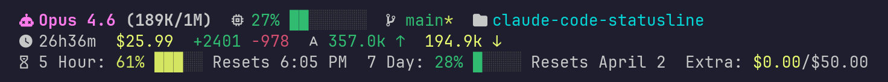

# Claude Code Statusline

A configurable statusline for [Claude Code](https://docs.anthropic.com/en/docs/claude-code) with NerdFont icons and text fallbacks.

> [!NOTE]
> This project is entirely vibecoded.

Forked from [daniel3303/ClaudeCodeStatusLine](https://github.com/daniel3303/ClaudeCodeStatusLine) and [kamranahmedse/claude-statusline](https://github.com/kamranahmedse/claude-statusline).



## Features

- **NerdFont icons** with automatic text fallbacks
- **Configurable segments** — show exactly the info you want
- **Presets** — Minimal, Standard, Full, or Custom segment selection
- **Color-coded indicators** — green/yellow/red based on usage levels
- **Progress bars** — visual context and rate limit usage
- **Auto-compact aware** — context % reflects your configured compact window
- **All available data** from Claude Code's statusline API:
  - Model name (color-coded by type)
  - Context window usage (bar, percentage, or token count)
  - Git branch, dirty status, ahead/behind
  - Current directory
  - Session duration
  - Session cost (USD)
  - Lines added/removed
  - Token counts (input/output)
  - Thinking effort level
  - Agent name and worktree info
  - Claude Code version
  - Output style
  - 5-hour and 7-day rate limits with reset times
  - Extra usage credits

## Installation

### Quick Install (npx)

```bash
npx claude-code-statusline
```

### One-line Install (curl)

```bash
curl -fsSL https://raw.githubusercontent.com/pottekkat/claude-code-statusline/main/install.sh | bash
```

Both methods run an interactive installer that:
1. Checks dependencies (`jq`, `git`, `bc`)
2. Detects NerdFonts on your system
3. Lets you choose a preset or pick individual segments
4. Configures display styles (progress bars, percentages, etc.)
5. Installs the statusline script and updates your Claude Code settings

### Manual Install

```bash
git clone https://github.com/pottekkat/claude-code-statusline.git
cd claude-code-statusline
bash install.sh
```

### Manual Setup (without installer)

1. Copy `statusline.sh` to `~/.claude/statusline.sh`
2. Create `~/.claude/statusline-config.json` (see [Configuration](#configuration))
3. Add to `~/.claude/settings.json`:
   ```json
   {
     "statusLine": {
       "type": "command",
       "command": "bash \"$HOME/.claude/statusline.sh\""
     }
   }
   ```
4. Restart Claude Code

### Uninstall

```bash
bash install.sh --uninstall
# or
npx claude-code-statusline --uninstall
```

## Configuration

The installer creates a config file at `~/.claude/statusline-config.json`:

```json
{
  "nerdfonts": true,
  "segments": "agent,worktree,model,context,git,directory,duration,cost,lines,tokens,effort,style,rate_5h,rate_7d,extra",
  "context_style": "bar",
  "rate_style": "bar"
}
```

### Options

| Option | Values | Default | Description |
|--------|--------|---------|-------------|
| `nerdfonts` | `true` / `false` | `true` | Use NerdFont icons |
| `segments` | comma-separated list | (see below) | Which segments to show |
| `context_style` | `"bar"` / `"percent"` / `"tokens"` | `"bar"` | How to display context usage |
| `rate_style` | `"bar"` / `"percent"` | `"bar"` | How to display rate limits |

### Available Segments

| Segment | Description | Shows when |
|---------|-------------|-----------|
| `agent` | Agent name | Running as an agent |
| `worktree` | Worktree name and branch | In a worktree |
| `model` | Model name, colored by type | Always |
| `context` | Context window usage | Always |
| `git` | Branch, dirty, ahead/behind | In a git repo |
| `directory` | Current directory name | Always |
| `duration` | Session wall-clock time | After first response |
| `cost` | Session cost in USD | API users with cost > 0 |
| `lines` | Lines added/removed | After code changes |
| `tokens` | Input/output token counts | After first response |
| `effort` | Thinking effort (high/low/medium) | When set to non-default |
| `version` | Claude Code version | Always |
| `style` | Output style name | When non-default |
| `api_time` | API time percentage | Used with `duration` |
| `rate_5h` | 5-hour rate limit | Pro/Max subscribers |
| `rate_7d` | 7-day rate limit | Pro/Max subscribers |
| `extra` | Extra usage credits | When enabled |

### Presets

**Minimal** — Just the essentials:
```
model, context, git
```

**Standard** (recommended) — Clean display with rate limits below:
```
agent, worktree, model, context, git, directory, duration, cost, lines, effort
+ rate_5h, rate_7d, extra (second line)
```

**Full** — Everything including tokens, version, and API time:
```
All segments enabled
```

### Customizing Icons

All NerdFont icons are defined as variables at the top of `statusline.sh`. To change an icon, edit the corresponding `NF_ICON_*` variable. Find icons at [nerdfonts.com/cheat-sheet](https://www.nerdfonts.com/cheat-sheet).

## Dependencies

**Required:**
- `jq` — JSON parsing
- `git` — Git status info
- `bc` — Number formatting

**Optional:**
- `curl` — Rate limit API calls (for Pro/Max subscribers)
- A [NerdFont](https://www.nerdfonts.com/) — For icons (text fallbacks available)

## How It Works

Claude Code pipes JSON session data to the statusline script via stdin. The script parses this data with `jq` and outputs formatted text with ANSI colors. The statusline updates after each assistant message, permission mode change, or vim mode toggle.

When `CLAUDE_CODE_AUTO_COMPACT_WINDOW` is set in your settings, the context usage percentage is recalculated against the compact window size instead of the full context window. The context label shows the effective window (e.g., `210K/1M`).

Rate limit data comes from either:
1. The built-in `rate_limits` field in the JSON (newer Claude Code versions)
2. OAuth API fallback (`api.anthropic.com/api/oauth/usage`) with 60-second caching

## License

[MIT](LICENSE)
